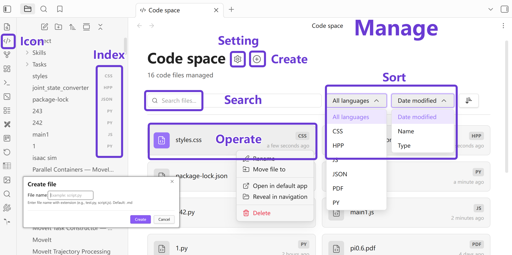
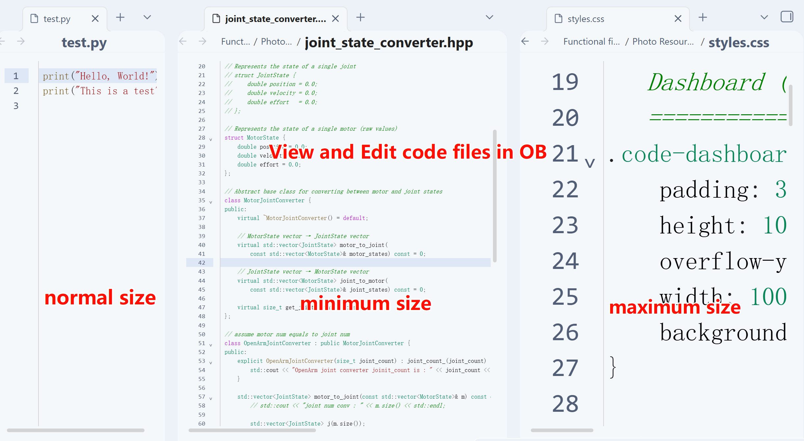
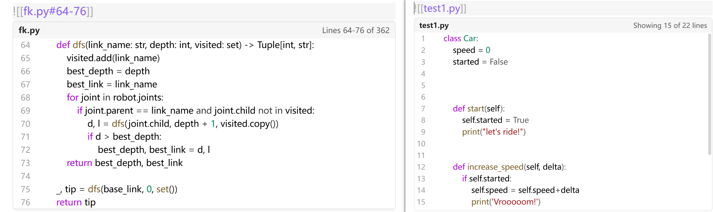
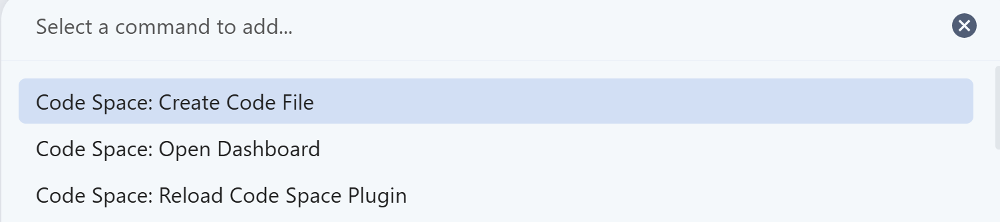

# Code Space

<h1 align="center">
    Professional Code File Management for Obsidian
</h1>

<p align="center">
    
    
</p>

<p align="center">
    <span>A comprehensive plugin for code file management in Obsidian</span>
    <br/>
    <a href="/README.md">English</a>
    ·
    <a href="/README_CN.md">简体中文</a>
</p>

---

## About

Obsidian does not support **code file viewing, management, and editing** by default. Code Space was created to solve this problem.

**The Three Layers of "Space":**

1. **Management Space**: Unified indexing and management for code files through a visual dashboard
2. **Editing Space**: Professional code viewing and editing environment within code files
3. **Embedding Space**: Deep integration with Obsidian native features for code file references and embedded previews

---

## Core Features

### 1. Code File Management Space

Unified management of all code files through a visual dashboard

- **Visual Dashboard**: Browse and manage all code files through a dedicated interface
- **Smart Filtering**: Filter by file extension and search by filename
- **Right-Click Actions**: Rename, move, delete, open in system app
- **Quick Creation**: Create new code files with one click

<p align='center'></p>

### 2. Professional Code Editing Space

Syntax highlighting, line numbers, code folding, and more

- **Syntax Highlighting**: Multi-language syntax highlighting powered by CodeMirror 6
- **Smart Editing**: Auto-indentation, bracket matching, code folding
- **Line Numbers**: Optional line number display
- **Manual Save**: Save with Ctrl+S, preventing unintended modifications
- **Font Scaling**: Adjust font size with Ctrl+Mouse Wheel
- **Keyboard Shortcuts**: Comprehensive keyboard shortcuts support (see below)

<p align='center'></p>

### 3. Obsidian Native Syntax Embedding

Elegantly embed and preview code in Markdown notes

- **File References**: Link code files using `[[filename]]` syntax
- **Code Embedding**: Embed code previews in Markdown using `![[filename]]`
- **Quick Preview**: Hover over links to preview code content
- **Bidirectional Sync**: Automatic detection and notification of external modifications

<p align='center'></p>

---

## Configuration

Access plugin settings via: **Settings > Community Plugins > Code Space**

- **Managed Extensions**: Comma-separated list of file extensions for Code Space to manage
- **Show Line Numbers**: Toggle line number display (default: enabled)
- **Max Embed Lines**: Maximum lines to display in embedded previews (default: 30, 0 for unlimited)

---

## Supported Languages (Extensible)

| Language | Extensions |
|----------|------------|
| Python | `.py` |
| C/C++ | `.c`, `.cpp`, `.h`, `.hpp` |
| JavaScript/TypeScript | `.js`, `.ts`, `.jsx`, `.tsx`, `.mjs`, `.cjs` |
| Web Technologies | `.html`, `.htm`, `.css`, `.scss`, `.sass`, `.less` |
| Systems Programming | `.rs`, `.go` |
| Data | `.sql`, `.json`, `.yaml`, `.yml`, `.xml` |
| Scripting | `.php`, `.rb`, `.sh` |

*More languages can be added via plugin settings. The plugin supports management of files with any extension!*

- Code files are opened through Code Space's code editor interface
- Binary files (e.g., images or PDFs) are opened using Obsidian's native viewer

<p align='center'></p>

---

## Supported Keyboard Shortcuts

### Plugin Commands

<p align='center'></p>

| Command Path | Function |
|-------------|----------|
| `Ctrl+P` → "Open Code Dashboard" | Open code management panel |
| `Ctrl+P` → "Create Code File" | Create new code file |
| `Ctrl+P` → "Reload Code Space Plugin" | Reload plugin |

---

### Basic Operations

| Shortcut | Function |
|----------|----------|
| `Ctrl+S` | Save current file |
| `Ctrl+Mouse Wheel` | Adjust font size |
| `Ctrl+C` | Copy selection |
| `Ctrl+X` | Cut selection |
| `Ctrl+V` | Paste |
| `Ctrl+A` | Select all |
| `Ctrl+Z` | Undo |
| `Ctrl+Y` or `Ctrl+Shift+Z` | Redo |
| `Tab` | Increase indent |
| `Shift+Tab` | Decrease indent |

### Cursor Navigation

| Shortcut | Function |
|----------|----------|
| `↑` `↓` `←` `→` | Move cursor up/down/left/right |
| `Home` | Jump to line start |
| `End` | Jump to line end |
| `Ctrl+←` | Move left one word |
| `Ctrl+→` | Move right one word |
| `Ctrl+Home` | Jump to file start |
| `Ctrl+End` | Jump to file end |
| `Page Up` | Scroll up |
| `Page Down` | Scroll down |

### Selection Operations

| Shortcut | Function |
|----------|----------|
| `Shift+Arrow Keys` | Extend selection |
| `Ctrl+Shift+←` | Select to word start |
| `Ctrl+Shift+→` | Select to word end |
| `Ctrl+Shift+Home` | Select to file start |
| `Ctrl+Shift+End` | Select to file end |

### Editing Operations

| Shortcut | Function |
|----------|----------|
| `Backspace` | Delete character before cursor |
| `Delete` | Delete character after cursor |
| `Ctrl+Backspace` | Delete word before cursor |
| `Ctrl+Delete` | Delete word after cursor |
| `Enter` | New line with indent preserved |

---

## Installation

### Method 1: Via Obsidian Community Plugins (Recommended)

1. Open **Settings > Community Plugins**
2. Turn off "Safe mode"
3. Click "Browse" button
4. Search for "Code Space"
5. Click "Install" and enable

### Method 2: Manual Installation

1. Visit [Releases](https://github.com/unlinearity/Obsidian-Codespace/releases/latest) to download the latest version
2. Extract files to plugin directory: `.obsidian/plugins/code-space/`
3. Reload and enable in Obsidian settings

---

## Development

### Requirements

- Node.js 16 or higher
- npm

### Build Commands

```bash
npm install          # Install dependencies
npm run dev          # Development build (file watching)
npm run build        # Production build
npm run lint         # Run ESLint
```

### Project Structure

```
obsidian-codespace/
├── src/
│   ├── main.ts           # Plugin initialization
│   ├── code_view.ts      # Code editor implementation
│   ├── code_embed.ts     # Markdown embed handler
│   ├── code_dashboard.ts # File browser interface
│   └── settings.ts       # Settings UI
├── styles.css            # Plugin styles
├── manifest.json         # Plugin metadata
└── package.json
```

---

## Contributing

Contributions are welcome via Pull Request!

Please ensure:
1. Code passes ESLint checks
2. Follows existing code style
3. Commit messages are clear and descriptive

For issues or suggestions, please use [GitHub Issues](https://github.com/unlinearity/Obsidian-Codespace/issues).

---

## Known Limitations

- Code file content not indexed by Obsidian global search
- Find and replace functionality not implemented

---

## Acknowledgments

Built with:
- [Obsidian API](https://github.com/obsidianmd/obsidian-api)
- [CodeMirror 6](https://codemirror.net/)
- [TypeScript](https://www.typescriptlang.org/)

---

## Contact

- Author: unlinearity
- Email: unlinearity@gmail.com
- Issues: [GitHub Issues](https://github.com/unlinearity/Obsidian-Codespace/issues)
- [MIT License](LICENSE) - Copyright (c) 2026 unlinearity

---

**Making code management simple and efficient in Obsidian!**
